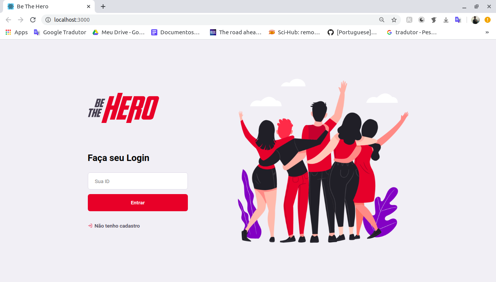
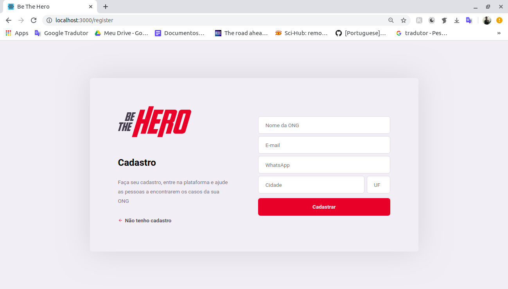
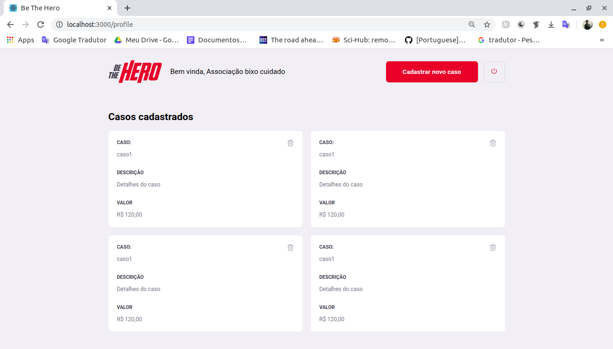
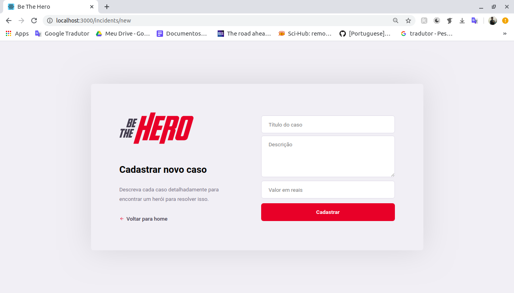
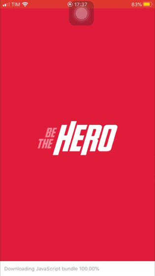
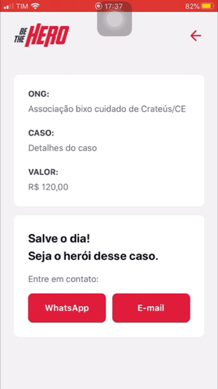

### Aplicação desenvolvida na 11° Semana OmniStack da RocketSeat.
 
 Projeto consiste em aplicação para ONG's cadastrarem casos para qual necessitam de ajuda financeira, onde o cadastro é feito na versão web da aplicação, e os os usuários, através do app, podem selecionar quais casos lhes interessarem e entrar em contato com a ONG, através de E-mail ou Whatsapp.

#### Tecnologias utilizadas: 
- Backend com Node.Js e Express.
- Banco de dados com Sqlite3.
- Front com React.Js.
- Mobile com React Native.

#### Front-end:

#### Mobile:

